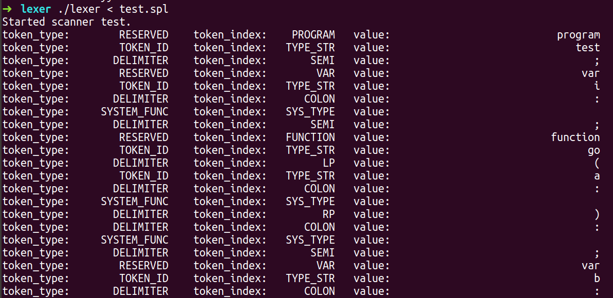

## 1 lexer

### 1.1 files

- token.h
- lexer.l
- lexertest.c 
  - test the function of lexer
  - the function to reveal token_type included
- Makefile
- test.spl


### 1.2 inctruction

```powershell
make clean
make lexer
./lexer < test.spl
```


### 1.3 output

